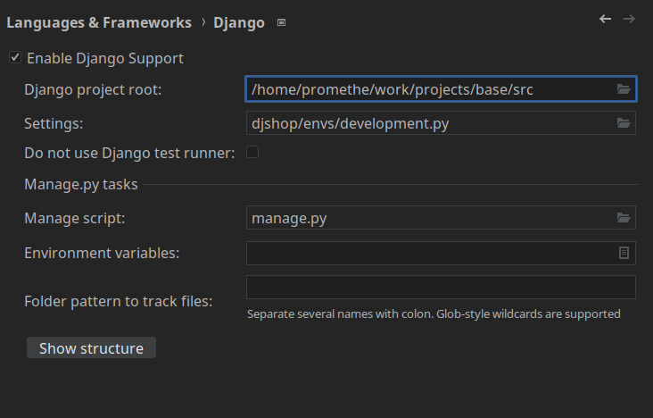
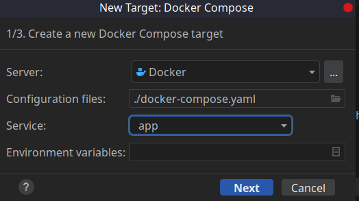
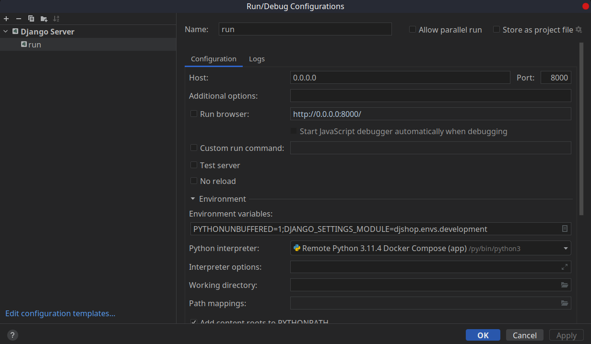

# Base
Base django project you can clone and use based on the modern application best practices.
It will make your development and production environment similar to each other.
also if you use pycharm your can use `docker-compose` to be your interpreter and test application through 
docker container. 

# what is included ?
- [x] python & django
- [x] django rest framework
- [x] drf-spectacular
- [x] postgres
- [x] dockerized

# Requirements

```markdown
- docker
```

# how to set up in pycharm 

**Step 0 :** create these nested directory in base directory
```text
data > web
```

**Step 1 :** make `src` directory as a `sources root` of project
```text
click on scr > mark directory as > sources root
```

**Step 2 :** enable django support from settings and set root project and setting path



**Step 3 :** set python interpreter from this path
```text
add new interpreter > on docker compose ...
```


**Step 4 :** select `app` from services and let docker build container. at the end set python 
path as `/py/bin/python3`

**Step 5 :** create new django server configuration like this : 

